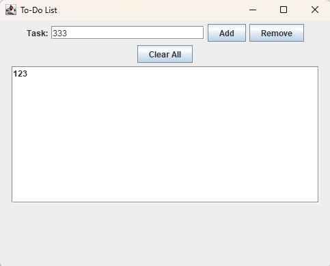

# ✅ To-Do List Application

Приложение для управления списком задач на Java Swing.

## ✨ Особенности

• ➕ Добавление задач  
• ❌ Удаление выбранной задачи  
• 🗑 Очистка списка задач  
• 📋 Просмотр всех задач  

## 🚀 Быстрый запуск

1. Скачать проект  
2. Открыть в IntelliJ IDEA  
3. Запустить файл ToDoList.java  
4. Использовать приложение  

## 📷 Скриншоты

## 🛠 Технологии

• Java  
• Java Swing  
• AWT  

